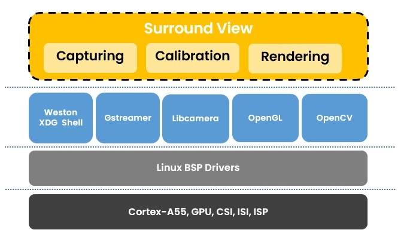
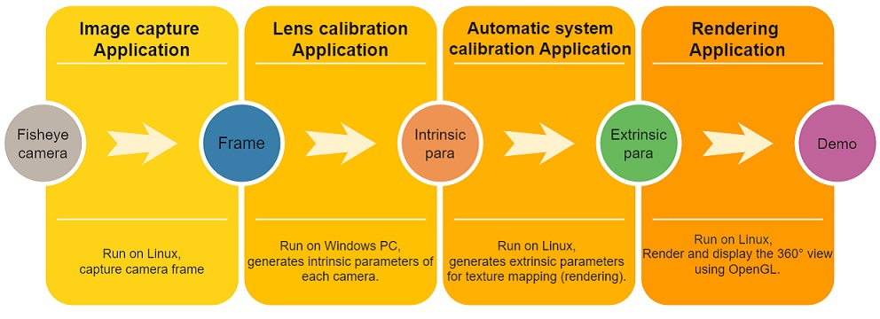
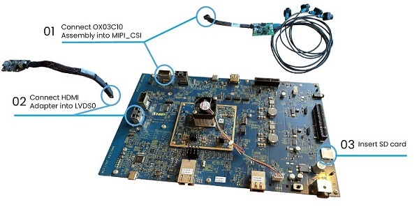
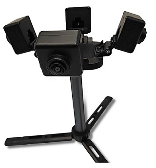

# i.MX Surround View

<!----- Boards ----->
[](./BSD_3_Clause.txt) [](https://www.nxp.com/products/processors-and-microcontrollers/arm-processors/i-mx-applications-processors/i-mx-9-processors/i-mx-95-applications-processor-family-high-performance-safety-enabled-platform-with-eiq-neutron-npu:iMX95)
 

The NXP Surround View System is a technology which provides a 360-degree wraparound a view that can be used for automotive, industrial, and consumer use cases. Providing a 360-degree view assists the driver of an automobile in parking the vehicle safely. Industrial and consumer use cases include building, store and home views of the surrounding property or interior of key rooms for both security, safety and key retail use cases such as customer counting.


## 1 Software Overview

>**NOTE:** Evaluated on BSP LF-6.6.52_2.2.0.

i.MX Board          | Main Software Components
---                 | ---
**i.MX 95 EVK**     | GStreamer + Libcamera + OpenGL     

There is a meta layer that includes the camera mirror patch.

### Models information

Information         | Value
---                 | ---
Camera resolution   | 4x 1920*1280@30fps fisheye
Display resolution  | 1920*1080@60fps LVDS->HDMI
ISP frequency       | 667 MHZ
GPU frequency       | 1 GHZ

There are 3 applications in this demo:

  

Perform Lens calibration and system calibration to get intrinsic parameter of cameras and extrinsic parameter. 

  

###  1. Lens capture application:
For a proper lens (intrinsic camera) calibration, the image capturing for each separate camera must be done first.
###  2. System calibration application:
The system calibration is performed using the Automatic Calibration application. It makes all preprocessing calculation and generates files for texture mapping (rendering). 
#### The algorithm consists of next steps:
 
  1. Load camera frames.
  2. Remove fisheye distortion.
  3. Estimate extrinsic pose of each camera.
  4. Generate 3D grid for texture mapping.
  5. Calculate masks for seamless blending.
  6. Generate grid of overlap ROIs for exposure correction.

### 3. Real-Time Rendering application:
It renders the camera frames on a prepared 3D mesh and blends them.
#### The algorithm consists of next steps:
  1. Load vertices and texels coordinates from external files.	
  2. Load blending mask from external files.
  3. Load 3D car model.
  4. Load camera frames from static images.
  5. Directly map the camera frames on 3D plane with use of OpenGL.
  6. Blend the frames with use of OpenGL shaders.
  7. Apply exposure correction.

OpenCV library is used for images, videos and masks loading.
Assimp library is used for 3D car model loading.
GLM library is used for view rotation/translation on the screen.
OpenGL ES library is used for rendering.

There are 2 input types in this demo, camera input and video input, camera input uses 4 fisheye cameras, video input uses 4 clips of video instead of real cameras.

## 2 Hardware Overview

The surround view system uses 4 fisheye cameras and displays a 360° output view. It uses a Serializer-Deserializer to interface with the cameras and uses LVDS or MIPI DSI to display the output onto a screen (1080p).

Component                                         | i.MX 95        
---                                               | :---:             
Power Supply                                      | :white_check_mark:
HDMI Display                                      | :white_check_mark:
USB Type-C cable                                  | :white_check_mark:                  
HDMI cable                                        | :white_check_mark:
IMX-LVDS-HDMI (LVDS to HDMI adapter)              | :white_check_mark:                  
Mini-SAS cable                                    | :white_check_mark:                  
4x OX03C10 with Serializer                        | :white_check_mark: 
De-serializer Board convert board                 | :white_check_mark: 
USB Mouse                                         | :white_check_mark: 
USB Keyboard                                      | :white_check_mark: 


## 3 Setup

### 1 Setup the hardware connection

  

### 2 Build the yocto image
This demo requires aligning 4 camera previews, the patch is included in this meta layer.

### 3 Choose the correct device tree
In this demo, choose imx95-19x19-evk-ox03c10-isp-it6263-lvds0.dtb

``` bash
u-boot=> setenv fdtfile imx95-19x19-evk-ox03c10-isp-it6263-lvds0.dtb
u-boot=> saveenv 
```

### 4 Build the Application
Steps for compiling and running the SV3D project on i.MX target board:
  1. Git clone the application source code.
  2. source the toolchain.
  3. Go to the App/Source folder.
  4. Build the project using command:

``` bash  
    make -f Makefile.xdg
```  
  For video input, clean the environment first:

``` bash  
    make -f Makefile.xdg clean  
```  
  Build with command:  

``` bash  
    make -f Makefile.xdg INPUT=video  
```  

### 5 Push and run the application
  1. push the whole surround-view folder to i.MX95 EVK
  2. Set the environment parameter:

``` bash  
    export LD_LIBRARY_PATH=/usr/lib/plugins/wayland-shell-integration/
```  

  3. Go to the App/Build folder, Copy the calibration file.

``` bash  
    cp -r ../Content/calibration_files/* ./ 
``` 

  4. Execute the 'SV3D-1.4_cameras' binary.

### 6 Fix the position of 4 cameras
  In this demo, an enclosure printed by 3D printer is used to fix the camera positions.
  If you don’t have this enclosure, you need to find a way to fix the camera.

  

## 4 Results
  Here is the demo using camera input:
  
  

  Demo using video input:
  
  

## 5. Release Notes

Version | Description                         | Date
---     | ---                                 | ---
1.0.0   | Initial release                     | Mar 11<sup>th</sup> 2025

## Licensing

*i.MX Surround View* is licensed under the [BSD_3_Clause](./Licenses/BSD-3-clause.txt).