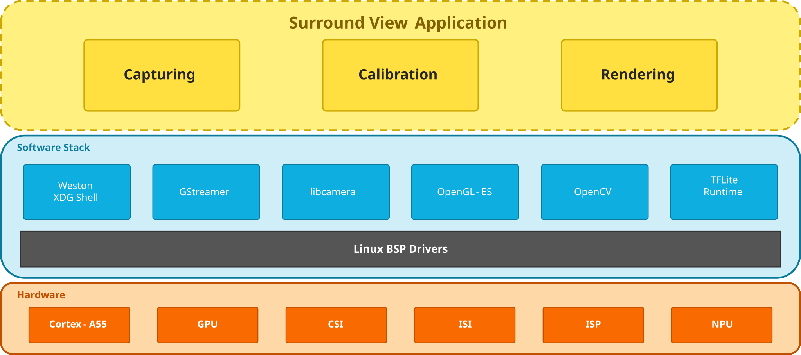
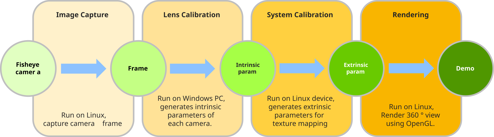
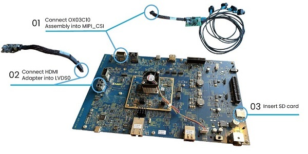
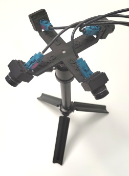
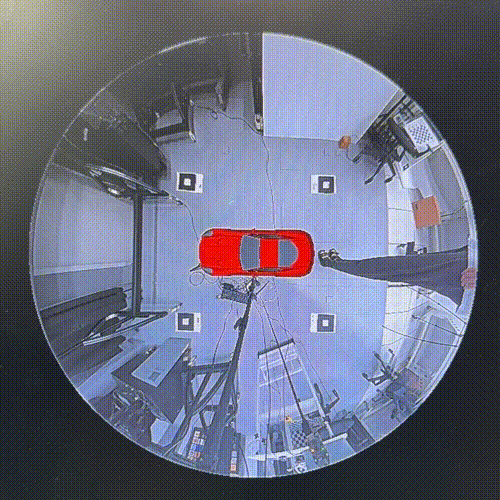
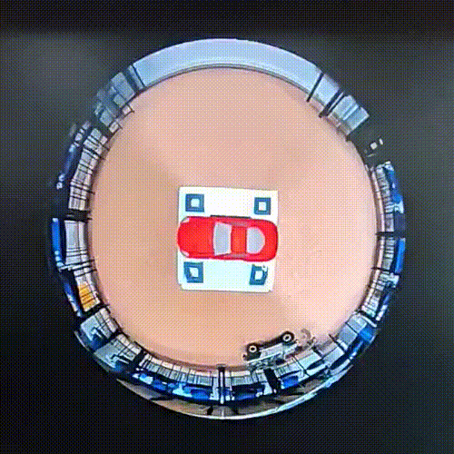
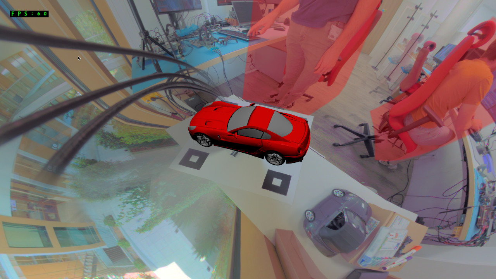

# i.MX Surround View

<!----- Boards ----->
[](./BSD_3_Clause.txt) [](https://www.nxp.com/products/processors-and-microcontrollers/arm-processors/i-mx-applications-processors/i-mx-9-processors/i-mx-95-applications-processor-family-high-performance-safety-enabled-platform-with-eiq-neutron-npu:iMX95)
 

The NXP Surround View System is a technology which provides a 360-degree wraparound view that can be used for automotive, industrial, and consumer use cases. Providing a 360-degree view assists the driver of an automobile in parking the vehicle safely. Industrial and consumer use cases include building, store, and home views of the surrounding property or interior of key rooms for security, safety, and key retail use cases such as customer counting.

## 1 Software Overview

The surround view system is a standalone application that relies on:

- **Wayland/Weston** for window management and event handling,
- **GStreamer**/**libcamera** for camera capture,
- **OpenGL-ES** for 3D rendering,
- **OpenCV** for camera calibration and distortion correction.



The surround view application can be run in 3 different modes:

- Capturing
- Calibration
- Rendering

The diagram below shows the calibration steps using the 3 runtime modes.
An extra offline step, running on Windows, is required for Lens Calibration.



### 1 Capturing

Lens calibration requires capture of checkerboard images in different angles.
The Capturing mode is used to capture frame images from each camera.
Lens calibration is performed on PC using OCamCalib Toolbox for Matlab to extract intrinsic camera parameters. See [Documentation](Doc) for more details.

### 2 Calibration

Calibration mode is used to perform automatic system calibration from intrinsic camera parameters and the 4-camera system.
The calibration generates extrinsic parameters and mesh files used for 3D texture mapping (rendering).

1. Load camera frames.
2. Remove fisheye distortion.
3. Estimate extrinsic pose of each camera.
4. Generate 3D grid for texture mapping.
5. Calculate masks for seamless blending.
6. Generate grid of overlap ROIs used for exposure correction.

### 3 Rendering

Rendering mode renders the camera frames on a prepared 3D mesh (bowls), blends them together and renders a 3D car model.

1. Load vertices, texture coordinates and blending mask.
2. Load 3D car model.
3. Start camera capture.
4. Perform NPU-based pedestrian detection on each camera frame.
5. Directly map the camera frames onto the 3D plane using OpenGL-ES.
6. Blend the frames using OpenGL-ES.
7. Apply exposure correction.

The application also supports video and static image input mode where pre-recorded video/image files replace the live camera feed.
It can be used for testing or demonstration purposes and for offline calibration for convenience.

>**NOTE:** Evaluated on BSP LF-6.18.20-2.0.0.

## 2 Hardware Overview

The surround view system uses 4 fisheye cameras and displays a 360° output view.
It uses a Serializer-Deserializer to interface with the cameras and uses LVDS or MIPI DSI to display the output onto a screen (1080p).

Component                                         | i.MX 95
---                                               | :---:
Power Supply                                      | :white_check_mark:
HDMI Display                                      | :white_check_mark:
USB Type-C cable                                  | :white_check_mark:
HDMI cable                                        | :white_check_mark:
IMX-LVDS-HDMI (LVDS to HDMI adapter)              | :white_check_mark:
Mini-SAS cable                                    | :white_check_mark:
4x OX03C10 with Serializer                        | :white_check_mark:
Deserializer / conversion board                   | :white_check_mark:
USB Mouse                                         | :white_check_mark:
USB Keyboard                                      | :white_check_mark:

Information         | Value
---                 | ---
Camera resolution   | 4x 1920x1280@30fps fisheye
Display resolution  | 1920x1080@60fps
ISP frequency       | 667 MHz
GPU frequency       | 1 GHz

## 3 Demo Setup

### 1 Hardware connection



### 2 Camera stand

Use camera stand for mounting 4 cameras.
Printable 3D model files are provided in the [CamStand](./Tools/CamStand/) folder for the enclosure of supported cameras.



### 3 Device tree

Choose a device tree that supports your cameras. OX03C10 cameras are used for this demo on i.MX95 `imx95-19x19-evk-ox03c10-isp-it6263-lvds0.dtb`

```bash
u-boot=> setenv fdtfile imx95-19x19-evk-ox03c10-isp-it6263-lvds0.dtb
u-boot=> saveenv
```

### 4 Build

Clone the repository and go to surround-view-imx directory.

```bash
git clone https://github.com/nxp-imx-support/surround-view-imx.git
cd surround-view-imx
```

#### Linux Build

Run CMake command.

```bash
source /opt/fsl-imx-xwayland/6.18-wrynose/environment-setup-armv8-2a-poky-linux

BUILD_TYPE=Release
WINDOWING_SYSTEM=Wayland
DEVICE=IMX9

SOURCES=.
BUILDS=../${PWD##*/}-builds
BUILD=$BUILDS/$ARCH-$OECORE_SDK_VERSION-$BUILD_TYPE
INSTALLS=../${PWD##*/}-installs
INSTALL=$INSTALLS/$ARCH-$OECORE_SDK_VERSION-$BUILD_TYPE

mkdir -p $BUILD
cmake \
    -DCMAKE_TOOLCHAIN_FILE=$CMAKE_TOOLCHAIN_FILE \
    -DCMAKE_BUILD_TYPE=$BUILD_TYPE \
    -DCMAKE_INSTALL_PREFIX=$INSTALL \
    -DDEVICE=$DEVICE \
    -DWINDOWING_SYSTEM=$WINDOWING_SYSTEM \
    -B$BUILD -H$SOURCES
cmake --build $BUILD -j$(nproc)
cmake --install $BUILD
```

Deploy on device.

```bash
scp -r $INSTALL/SV3D root@<target_ip>:~/
```

#### Android Build

Run CMake command.

```bash
# SDK
export ANDROID_BUILD_TOOLS_VERSION=35.0.0
export ANDROID_PLATFORM_LEVEL=35
export ANDROID_SDK=${HOME}/Android/sdk
export ANDROID_SDK_ROOT=$ANDROID_SDK
export ANDROID_API_LEVEL=$ANDROID_PLATFORM_LEVEL
export ANDROID_PLATFORM=android-$ANDROID_PLATFORM_LEVEL

# NDK
export ANDROID_NDK_VERSION=28.2.13676358
export ANDROID_NDK=${ANDROID_SDK}/ndk/${ANDROID_NDK_VERSION}
export PATH=$ANDROID_SDK:$ANDROID_SDK/bin:$ANDROID_NDK:$PATH
export ANDROID_CMAKE_TOOLCHAIN=$ANDROID_NDK/build/cmake/android.toolchain.cmake

# Java
export JAVA_HOME=/usr/lib/jvm/java-21-openjdk-amd64

# Platform
export ANDROID_ABI=arm64-v8a

SOURCES=.
BUILDS=../${PWD##*/}-builds
INSTALLS=../${PWD##*/}-installs

BUILD_TYPE=Release
WINDOWING_SYSTEM=Android
DEVICE=IMX9
BUILD=$BUILDS/android-$ANDROID_PLATFORM_LEVEL-arm64-$BUILD_TYPE
INSTALL=$INSTALLS/android-$ANDROID_PLATFORM_LEVEL-arm64-$BUILD_TYPE

rm -rf $BUILD
mkdir -p $BUILD
cmake \
    -DCMAKE_BUILD_TYPE=$BUILD_TYPE \
    -DCMAKE_TOOLCHAIN_FILE=$ANDROID_CMAKE_TOOLCHAIN \
    -DCMAKE_INSTALL_PREFIX=$INSTALL \
    -DANDROID_NDK=$ANDROID_NDK \
    -DANDROID_ABI=$ANDROID_ABI \
    -DANDROID_API_LEVEL=$ANDROID_API_LEVEL \
    -DANDROID_PLATFORM=$ANDROID_PLATFORM \
    -DANDROID_NDK_VERSION=$ANDROID_NDK_VERSION \
    -DWINDOWING_SYSTEM=$WINDOWING_SYSTEM \
    -DDEVICE=$DEVICE \
    -DUSE_OBJDET=OFF \
    -B$BUILD -H$SOURCES

cmake --build $BUILD -j$(nproc)
```

Deploy

```bash
adb install $BUILD/com.nxp.sv3d.apk
```

### 5 Run

#### Linux

```bash
export LIBCAMERA_PIPELINES_MATCH_LIST='nxp/neo,imx8-isi,uvc'
cd ~/SV3D
```

Run in Rendering mode

```bash
./SV3D-Wayland
# or
./SV3D-Wayland render
```

Run in Capturing mode

```bash
./SV3D-Wayland capture
```

Run in Calibration mode

```bash
./SV3D-Wayland calib
```

Run in Dual mode (4 cameras grid + rendering application for example)

```bash
./SV3D-Wayland calib render
```

Refer to [SVAUG.pdf](Doc/SVAUG.pdf) for detailed usage instructions.

#### Android

The Android APK integrates all three modes — Capturing, Calibration, and Rendering — into a single application.

The Android app follows the same workflow as the Linux version described in [SVAUG.pdf](Doc/SVAUG.pdf). You can use it in the same way:

- **Rendering** — launch the app normally to start the 360-degree surround view rendering.
- **Calibration** — use the calibration function within the app to perform system calibration.
- **Capturing** — use the capturing function to capture checkerboard images from each camera for lens calibration. Press the keyboard **right arrow key (→)** to cycle through the 4 cameras one by one and capture images from each camera in turn.

> **NOTE:** To enable automatic G2D dewarp for mbcam cameras on Android, set the boot property `ro.boot.camera.layout` to `mbcam`. This can be done by adding the following line in U-Boot before booting:
> ```
> setenv append_bootconfig androidboot.camera.layout=mbcam
> ```

## 4 Results

Here is the demo using camera input:



Demo using video input:



Demo with Pedestrian detection:



### Performance

&nbsp; | Utilization | Note
--- | --- | ---
CPU | 61.9% (out of 600%) | Lock to performance mode
GPU | 44.98% | Lock to 1GHz
Memory bandwidth | 5379.3 MB/s | Global R+W

*Test environment: i.MX95 EVK L6.18.20 + uguzzi IPA. Measured with AI detection enabled and exposure correction disabled.*

## 5. Release Notes

Version | Description | Date | Tag
--- | --- | --- | ---
2.0.0 | Added Android support and touch screen support | Aug 31st 2026 | imx_ec_sv_v2.0
1.0.0 | Initial release | Mar 11th 2025 | imx_ec_sv_v1.0

## Licensing

*i.MX Surround View* is licensed under the [BSD_3_Clause](Licenses/BSD-3-Clause.txt).

